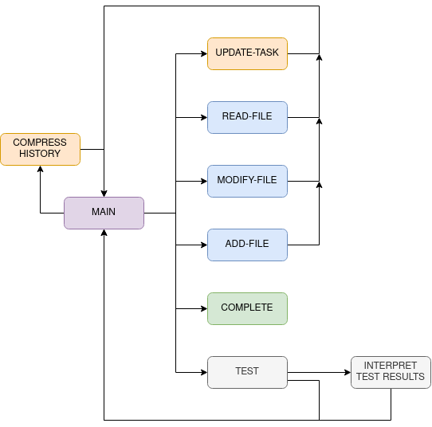
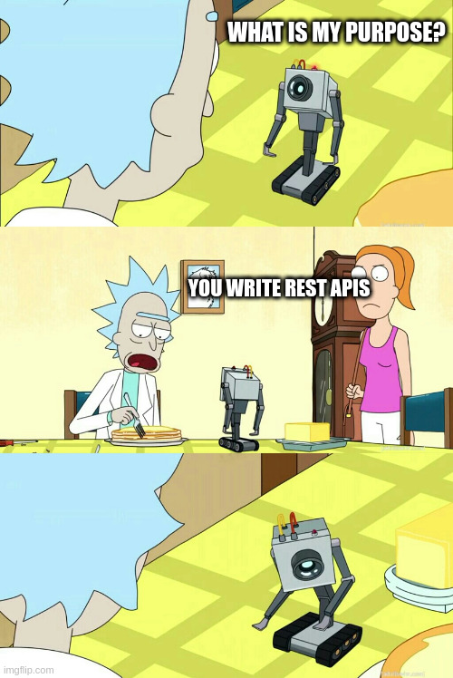

# Micro Agent

A tiny implementation of an autonomous agent powered by LLMs (OpenAI GPT-4)

What is this?

- A bare-bones AI software engineer (for Python for now...)
- A step towards AGI
- A research tool to experiment with agent development

What can it do?

- It writes software for you
- Give it a "purpose" and let it go!

Inspired by [langchain](https://github.com/hwchase17/langchain) and [micrograd](https://github.com/karpathy/micrograd)

## How to use?

Set your `OPENAI_API_KEY` environment variable

Edit `run.py` to set your `purpose` and the `directory` of the target application

Let it run free! `python run.py`

# To run with docker 

build your dockers with: `docker-compose build` 

run it with `docker-compose up`

## How does it work?

Its basically a small state machine. Each state performs some action and returns its desired next state

The main state is MAIN (the `run_main` function) - which asks the LLM to pick the next state

The agent has a `purpose` and a `task`
It can set its own `task` via `UPDATE-TASK` but it can't change its `purpose`...



## Example

Here is the thought process of the agent building a game for the purpose

    A terminal based game
    - the user must guess a number between 0-100
    - the game will reply if the number is higher or lower

```
observation: task has been updated to: Add a feature to allow the user to choose the range of numbers they want to guess from, instead of just 0-100.
thought: I need to modify the code to allow the user to choose the range of numbers they want to guess from
action: MODIFY-FILE action_input='./app/main.py'
observation: file does not exist
thought: I need to create the main.py file first
action: ADD-FILE action_input='./app/main.py'
observation: file successfully written
obsertation: In this new file, I added a main function that prompts the user to choose the range of numbers they want to guess from. The user is asked to enter the lower and upper bounds of the range, and the program generates a random number within that range for the user to guess. The rest of the game logic remains the same as in the original code. This modification allows for greater flexibility and customization in the game, as the user can now choose the range of numbers they want to guess from.
action: MODIFY-FILE action_input='./app/main.py'
observation: file successfully modified
obsertation: In the modified code, the main function has been updated to allow the user to choose the range of numbers they want to guess from. The user is prompted to enter the lower and upper bounds of the range, and the program generates a random number within that range for the user to guess. The rest of the game logic remains the same as in the original code. This modification allows for greater flexibility and customization in the game, as the user can now choose the range of numbers they want to guess from.
action: TEST
observation: there are no tests! Test should be written in a test folder under ./app
thought: I need to write tests to ensure that the new feature works as expected
action: ADD-FILE action_input='./app/test/test_main.py'
observation: file successfully written
obsertation: In this code, I added a new test file to test the main function in the main.py file. The test file contains two test cases. The first test case tests if the user wins the game by guessing the correct number. The second test case tests if the user makes a wrong guess and then wins the game by guessing the correct number. Both test cases use the patch function to mock the input function and the randint function. The first test case mocks the input function to return the values '10' and '50', and the randint function to return the value 25. The second test case mocks the input function to return the values '10', '20', '30', '40', '50', and the randint function to return the value 25 twice. The test cases assert that the main function returns the expected output for each scenario.
thought: I need to run the tests to ensure that the new feature works as expected
action: TEST
observation: tests passed
thought: The tests have passed and the task is complete
action: COMPLETE
```

## Limitations

A lot of limitations...

- writing tests for most apps are quite involved (web, terminal, REST)
- the agent needs tools to observe/run its creation
- the agent likes to write tests with numeric comparisons... which it gets wrong

## Next steps..

- A file-peek state (i.e. show the function names across the code base for a high level overview)
- Self reflection states (i.e. reflect on the current progress and potentially change task)
- Documentation loaders (i.e. a state that can load documentation for a library)


